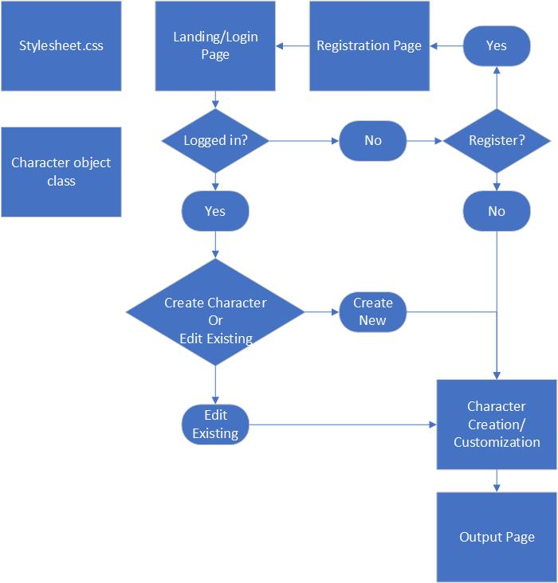

# Comp1073FinalProject
A GitHub Repo for the Comp 1073 Final Project

## Dungeons & Dragons: Character Creator
#### The Break It Group 
 >> Holly Bedard 200443133  
  Michael Caldwell 200445010  
  Eric Donnelly 200433532  
  Lani Low 200440104  
 
 >>> Client-Side JavaScript  
Professor Shivali Dhaka  
Tuesday, October 6, 2020
****
## Project Overview
This project is a Dungeons and Dragons ( D&D) Character Creator. We are starting to build it for the basic fifth edition rules ( 5e) however due to the sheer amount of possible race/class we have limited the selection based on those within the Player’s Handbook. 

We will have a landing page where clients can create an account or login to an existing account. If the users decide that they just want to make a 1 time character they do not need to create an account but there will be an option to save and reopen existing characters.  Users then proceed to the character creation page where they can create their character either by manually entering values, or by using the randomized roll tool. Once validated, the character stats are then sent to the character output page, where the user is given the option to save their character and/or print a character sheet using the data from the creation stage. If the user saves the character the data is stored in the database, using the JSON file connected to the userID. This allows the user to return to edit the character at a later time. 
### Development Environments and Third-party Integrations
> Stephanie /Holly IDE - Webstorm  
> Michael - Webstorm  
> Eric - WebStorm  
> Lani IDE - notepad/ atom  

>Third-party frameworks - Bootstrap CSS framework  
Database - MySQL

## Functional Requirements / Use Cases

##### JSON
>Used to store character stats for each user

 ##### Validation
> Ensuring valid data is entered by the user in all fields 
- Name fields *including username, character name*
- sanitized strings *no html/js elements or SQL expressions*
- Stat fields - integer values, range from 4-20 
-Passwords field *uppercase,lowercase and number ,special char ,min length 8, 1 of each type of character minimum*  
-Events

##### CSS
- creating a cohesive style for all pages
- adjusting bootstrap classes 

## Project Design

By: Michael Caldwell

## Work Assignments
>While we won’t work on each other's assigned sections, we do plan on reviewing each other's sections for a better understanding of our overall project.

#####Here’s a list of our currently planned features:
* Home (landing page)
* Login page (html w/ JS)
* Registration Page
* Character Creation  (html w/ JS)
* Output page w/ print  (html w/ JS)
* Stylesheet
* Database/ Json files 

##### And the following is a breakdown of what work we will each be doing:
###### Holly Bedard
Character creation page:
Responsible for the code which allows the user to create characters
Some fields generated with dice roll, others with dropdown menu
Character stat fields include:
Name
Race
Class
Background
Level
Traits (Strength, Dexterity, Constitution, Intelligence, Wisdom, Charisma)
Skills
Equipment (Armour, Tools)
Senses
Languages
Spells
The user has three options for creating their character:
Use a button that randomly selects values for each of the stats fields all at once.  
Use a randomized dice roller tool that allows the user to select each field individually.  
Use input fields which allows the user to enter their own values for each field.  If the user uses the randomizer tool, these input fields will be auto-populated with the results of the tool.
Create event listeners for each field which dynamically change main character image using the selected character stat.  
Data will be stored in a JSON file, which can also be stored in the database linked to the user if the user wants to return to edit their character later.
###### Michael Caldwell
Visio block diagram for project proposal - shows the general flow of how a user will interact with our website.
Output page - responsible for outputting a formatted character sheet that is ready for printing. This will involve retrieving data from our database or json file. 
Character classes - Multiple classes that define what a base character is, and any racial variants (Elf, Dwarf, Human, Gnome, etc) will be defined through inheritance as needed.
###### Eric Donnelly
CSS
Test cases
Validation
load/ save characters
###### Lani Low
Login/ register pages
Images
databases

###### Optional pages
* Avatar Creation

### References
* Wizards.com (2020), 5E Character Sheet Fillable. Retrieved from  https://media.wizards.com/2016/dnd/downloads/5E_CharacterSheet_Fillable.pdf

* DnD Beyond(2020), Character races for Dungeons & Dragons. Retrieved from https://www.dndbeyond.com/races

